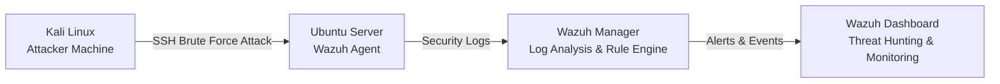

# Linux Security Monitoring using Wazuh

A hands-on Security Operations Center (SOC) lab built using Wazuh, Kali Linux, and Ubuntu. This project demonstrates endpoint monitoring, log collection, SSH attack simulation, and threat hunting.


## 📌 Project Overview

This project demonstrates **Linux Security Monitoring** using **Wazuh** to collect, monitor, and analyze security events from a Linux endpoint.
It focuses on authentication monitoring, SSH log analysis, threat hunting, and alert investigation, providing hands-on experience with core SOC Analyst and Blue Team operations.
---

## 🏗️ Lab Architecture




---

## 🛠️ Technologies Used

- Wazuh Manager
- Wazuh Dashboard
- Ubuntu Server
- Kali Linux
- OpenSSH
- Linux Audit Logs

---

## 📂 Project Structure

```
Mini-SOC-Lab/
│
├── README.md
├── images/
│   ├── architecture.png
│   ├── endpoint.png
│   ├── auth-log.png
│   ├── threat-dashboard.png
│   ├── ssh-events.png
│   └── brute-force-alert.png
└── documentation/
```

---

# Exercise 1 – Deploying Wazuh Agent

### Screenshot

![Endpoint Dashboard] 


---

# Exercise 2 – Verifying Agent Connectivity

### Screenshot


---

# Exercise 3 – Monitoring Authentication Logs

### Command

```bash
sudo tail -20 /var/log/auth.log
```

### Screenshot

![Authentication Logs] 


---

# Exercise 4 – Simulating SSH Brute Force Attack

### Command

```bash
hydra -l fakeuser -P passwords.txt ssh://<Target-IP>
```

### Screenshot

![SSH Attack]  


---

# Exercise 5 – Detecting Alerts in Wazuh

### Screenshot

![Brute Force Alerts] 

---

# Exercise 6 – Threat Hunting Dashboard

### Screenshot

![Threat Hunting Dashboard] 


---

# Exercise 7 – SSH Authentication Events

### Screenshot

![SSH Events Dashboard]  


---

## 🔍 Key Findings

- Wazuh successfully detected SSH authentication failures.
- Brute force attempts generated security alerts.
- Authentication logs were forwarded to the Wazuh Manager.
- Threat Hunting dashboard visualized attack activity in real time.

---

## 📖 Learning Outcomes

- Wazuh Deployment
- Endpoint Monitoring
- SSH Log Analysis
- Brute Force Detection
- Threat Hunting
- Alert Investigation
- Basic SOC Operations

---

## 👨‍💻 Author

**Shivam Pandey**

Aspiring SOC Analyst | Blue Team | Threat Hunting

TryHackMe: Top 2%
